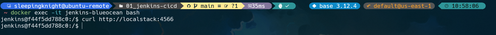
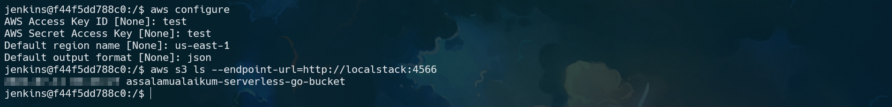

# Part: Setting Up AWS Credentials

**Step 1:** We need to connect **jenkins-bluocean container** to the **localstack network**, in order to establish communication between jenkins-blueocean and localstack containers

```shell
# Connect
docker network connect 01_jenkins-cicd_default jenkins-blueocean

# Disconnect
docker network disconnect 01_jenkins-cicd_default jenkins-blueocean
```


**Step 2:** Login to **jenkins-bluocean** container, and we can testing whether the jenkins-blueocean and localstack containers already established or not

```shell
docker exec -it jenkins-blueocean bash
```

Inside the jenkins-blueocean container, run the following command

```shell
curl http://localstack:4566
```



If there is no output (error message), it means that, our jenkins-blueocean container can communicate to the localstack container


**Step 3:** We can use AWS CLI with an endpoint URL by setting up arbitary credential and include the `--endpoint-url=<localstack-url>` flag in our aws CLI commands. 

```shell
aws configure
```

```shell
aws s3 ls --endpoint-url=http://localstack:4566
```


